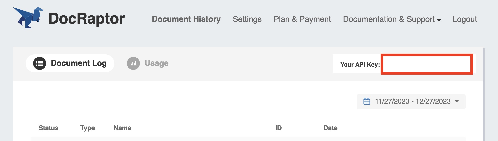

# md-book-with-docraptor

A node.js app to convert markdown files to a [single webpage](https://stebrech.github.io/md-book-with-docraptor/src/content.html) as well as two PDFs (content and cover) using DocRaptor.

## Install

Create a directory and navigate to it:

``` sh
mkdir md-book-with-docraptor
cd md-book-with-docraptor
```

Download this repository to the new created directory:

``` sh
git clone https://github.com/stebrech/md-book-with-docraptor .
```

Install all the dependencies using your favorite package manager:

``` sh
npm install
```

or

``` sh
yarn
```

## Markdown Files

Add your markdown files within the `src` folder. The name of the files are not used in the output but need to be named to represent the correct order. Therefore you could name the files `chapter01.md`, `chapter02.md` and so on.

### Headings

The book title uses a heading 1 and the subtitle a paragraph tag. Each markdown file will be put in a section tag. For semantic reasons and because of the default styles you should begin each markdown file with a heading 2 and use it only once for each chapter.

### Manual page break

The horizontal rule element (`<hr>`; markdown syntax `***`) is “misused” to create a manual page or column break. It is set to not visible either for screen and print.

## Metadata

We need some overall metadata which is placed in a json file called `metadata.json` as well directly in the `src` folder.

The following keys are excpected:

``` json
{
  "title": "md-book-with-docraptor",
  "subtitle": "A node.js app to convert markdown to PDF using Docraptor",
  "imprint": [
    { "label": "Text", "value": "Stefan Brechbühl" },
    { "label": "Images", "value": "Screenshots" },
    {
      "label": "Process",
      "value": "Markdown → HTML → PDF"
    },
    {
      "label": "Print",
      "value": "Name of the printing company"
    },
    {
      "label": "Website",
      "value": "<a href='https://stebre.ch'>stebre.ch</a>"
    }
  ],
  "cover_img": "assets/images/cover.png",
  "imprint_img": "assets/images/cover-photo.png",
  "excerpt": "The excerpt is a short description of the book. It is used on the back cover and as meta description."
}
```

## DocRaptor Key

I recommend to put the value of the `user_credentials` not directly into `docraptor.js`. You should do the following:

1. If you not already opened a DocRaptor account, let’s do that.
2. Copy your API key.
3. Add a new file called `.env` into your root folder.
4. Write `DOCRAPTOR_KEY=` and then paste your API key.
5. Save the file.



## Use the scripts

There are two scripts in this repository:

1. `md2html.js` creates a html of the content and the cover. Of both there will be an additional version which includes the assets (styles, images) inline.
2. `docraptor.js` sends two requests to Docraptor. One with `content-inline.html`, the other with `cover-inline.html`.

To run the scripts you need to write 

- `npm html` / `yarn html` or
- `npm pdf` / `yarn pdf` 

in the terminal.

If you want to run both with one command, use:

``` sh
npm start
```

or

``` sh
yarn start
```

### Turn of test mode of DocRaptor

If you are happy with the results and want to turn of the test mode, you need to change the value of `test` on line 28 in `docraptor.js` into `false`.

## Adjust the styles

Within the `general.css` file, there are some css variables you can modify or adjust the styles elswhere to fit your needs.

### Full page images

The print styles make all images in the book to be placed on a separate page.

## Known Issues

- [ ] The cover pdf includes a second blank page
- [ ] To create a PDF/X compliant pdf, the output intent must be set. You can configure that in Prince (see https://www.princexml.com/doc/graphics/#color-management-and-pdf-profiles), but with DocRaptor you would need to make the ICC profile online available. The DocRaptor support got a feature request from me about providing the most popular output intents.
