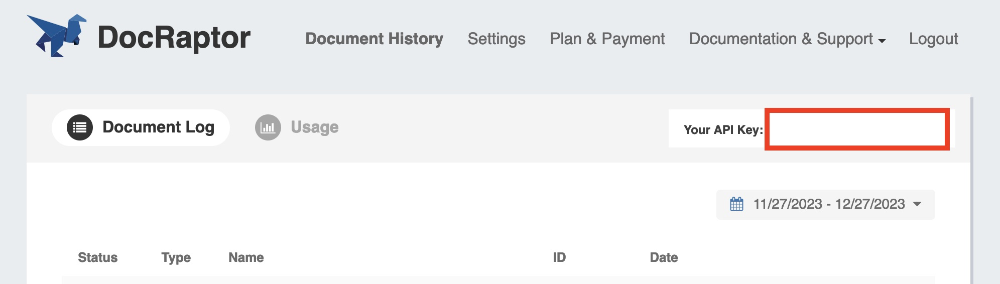

## DocRaptor Key

I recommend to put the value of the `user_credentials` not directly into `docraptor.js`. You should do the following:

1. If you not already opened a DocRaptor account, let’s do that.
2. Copy your API key.
3. Add a new file called `.env` into your root folder.
4. Write `DOCRAPTOR_KEY=` and then paste your API key.
5. Save the file.

